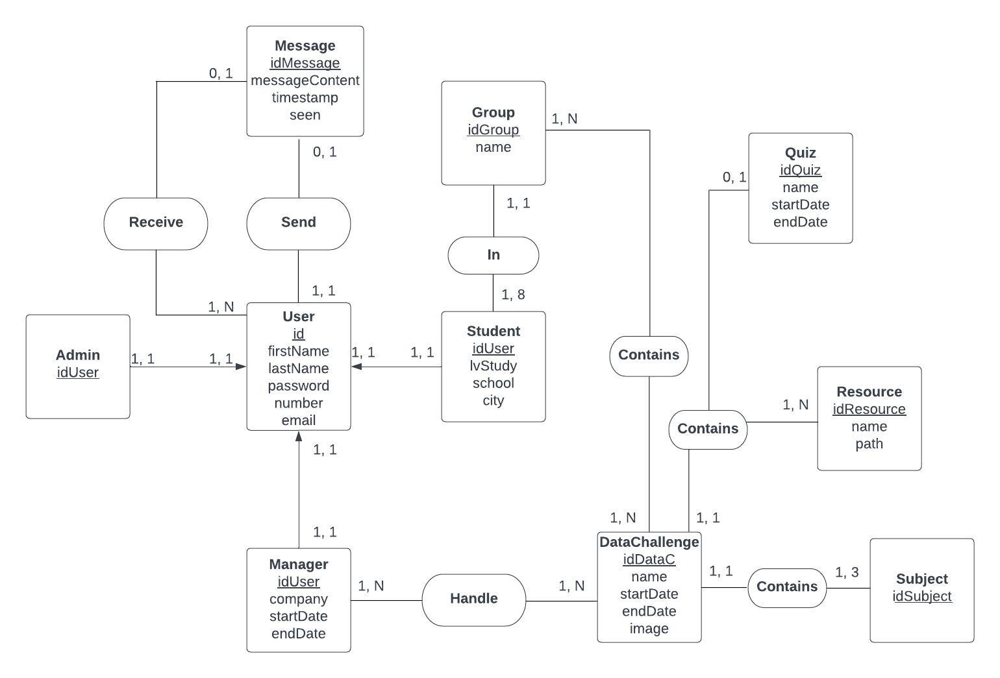
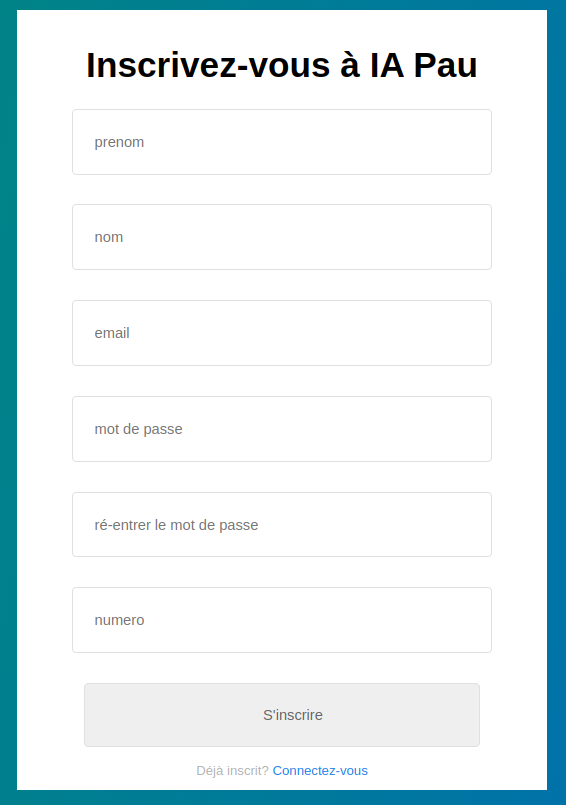
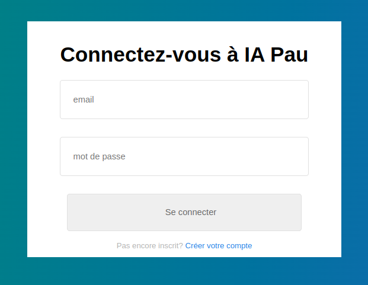
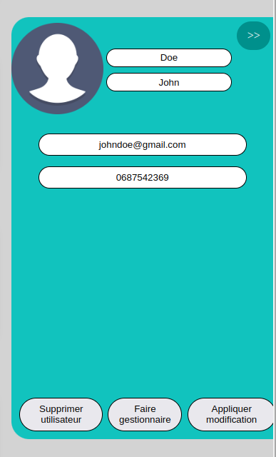
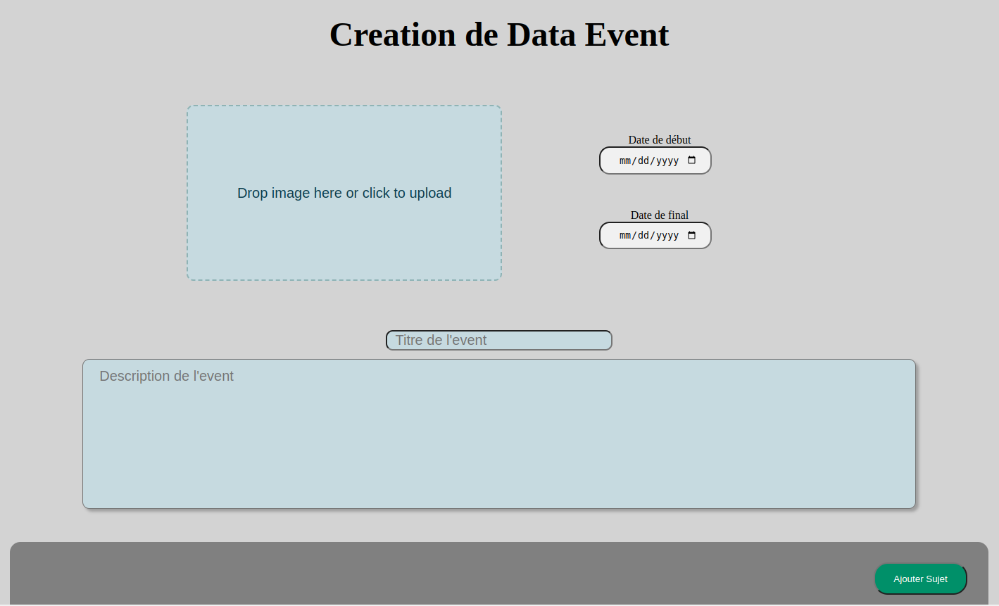
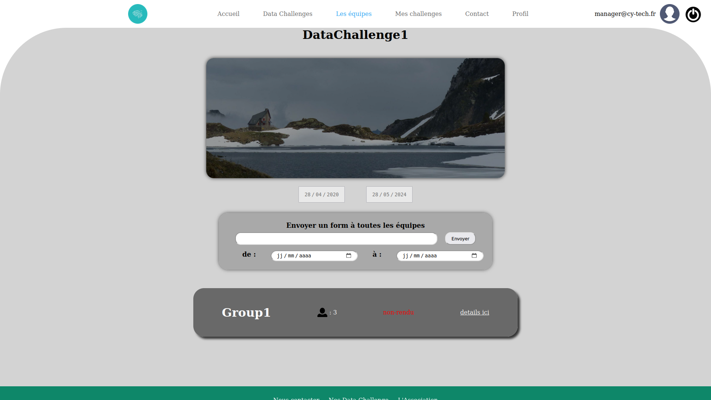
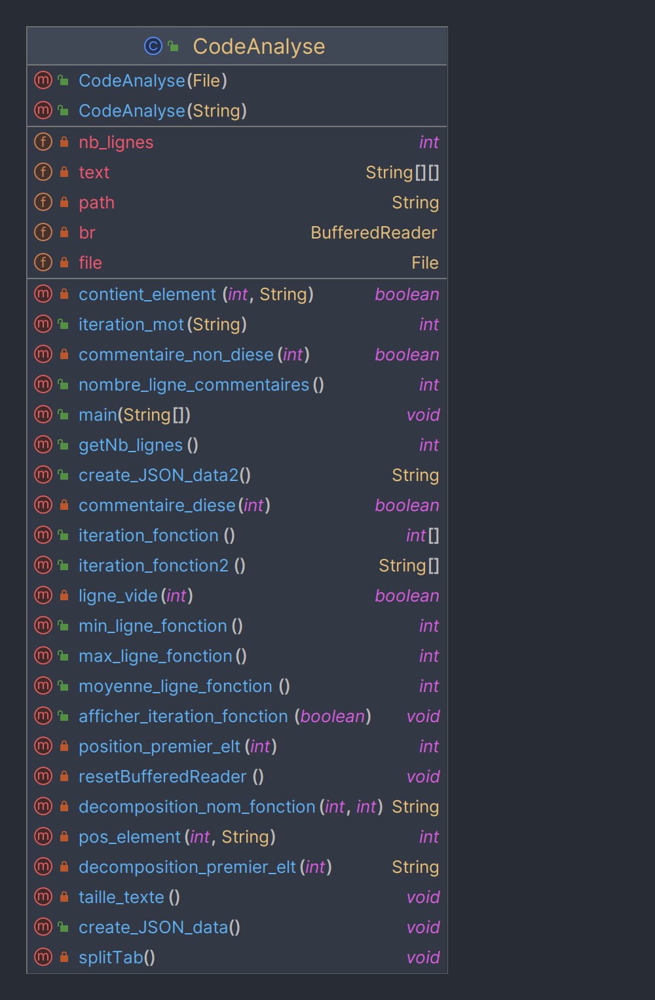
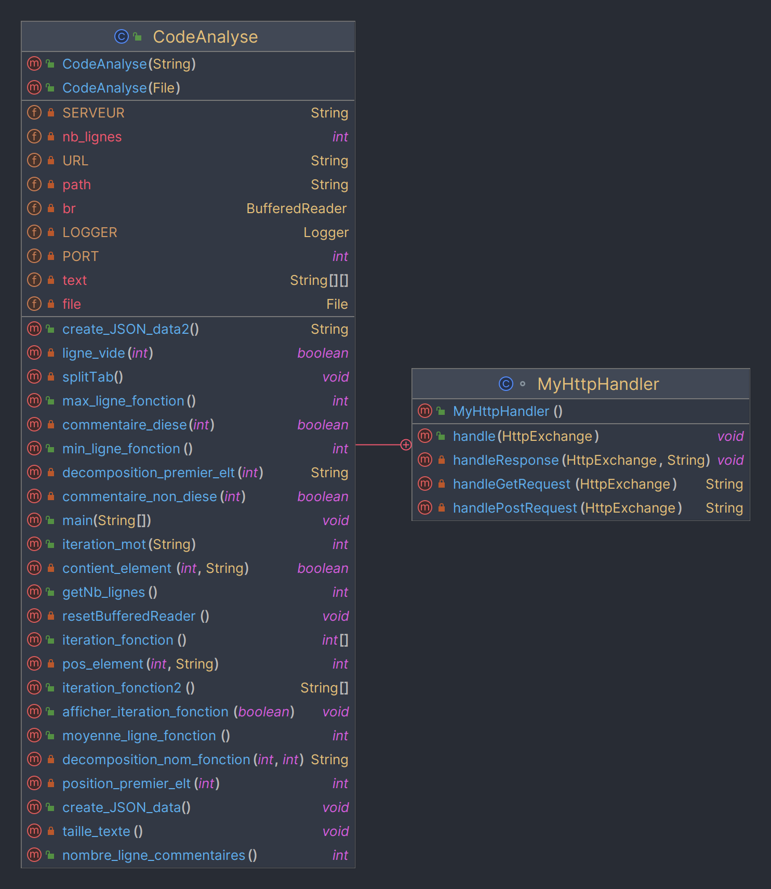
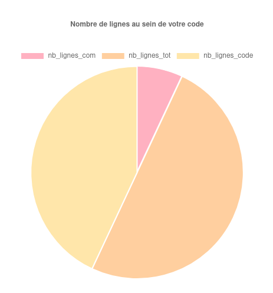
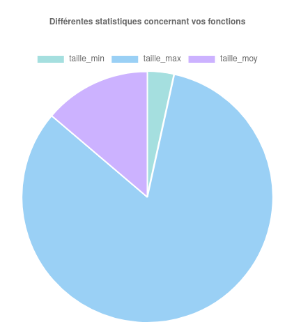

# I. Introduction 

&nbsp;&nbsp;&nbsp;&nbsp;&nbsp; Dans le cadre de notre première année du cycle ingénieur, il nous est proposé la réalisation d'un projet pour mettre en pratique nos connaissances.
Ce projet consiste en la réalisation d'une application pour IA Pau permettant la création et l'administration de data challenges.

Le dépôt git se trouve au lien suivant : [https://github.com/blj64/projetIng1.git](https://github.com/blj64/projetIng1.git)


# II. Notre organisation

&nbsp;&nbsp;&nbsp; Afin de réaliser ce projet, nous avons dû travailler en équipe. Ce défi peut effrayer mais avec un peu d'organisation et de travail, nous sommes arrivés à un résultat plutôt convaincant. 

Le premier jour, nous avons tous déclarer nos préféences au niveau du code. Lilian et Nicolas souhaitaient travailler sur le Backend, Matt sur l'analyseur de code et l'API Java, Jérémi s'occuperait de la messagerie et Lucas du Frontend. Nous avons ensuite réaliser un mld pour la base de donnée et un diagramme afin de structurer le site. 

Après s'être concerté pour le visuel du site et l'architecture de nos dossiers nous avons commencé à travailler chacun dans nos parties respectives. 

Afin de maintenir un rythme de travail élevé, nous utilisions github pour regrouper toutes nos avancés. Suite à ça, Nicolas à laissé Lilian finir les fonctions utiles à la base de donnée pour lier le back et le front. 

Une semaine avant la date de rendu, nous avons fait une réunion afin de déterminer les fonctionnalités qu'il fallait finir à tous prix. 


# III. Stockage des données

&nbsp;&nbsp;&nbsp;&nbsp; L'utilisation d'une base de données dans le contexte de ce projet est évident pour pouvoir stocker diverses informations comme celles concernant les utilisateurs ou les data chalenges.
Ainsi, nous avons réalisé un modèle conceptuel de données (MCD) pour réaliser ensuite la structure de la base de données.

## &nbsp;&nbsp;&nbsp; 1. Le Modèle conceptuel de données

{height=40%}

&nbsp;&nbsp;&nbsp; Un utilisateur peut être soit un administrateur, un gestionnaire ou un étudiant (un participant).
Un ensemble d'utilisateurs quelconques peut recevoir un message donné et un utilisateur peut aussi envoyer un message. On peut considérer qu'un étudiant puisse envoyer un message à un administrateur sous des conditions particulières (requête pour résoudre un bug, etc) qui peuvent être gérées lors du développement de l'application.
Un même groupe peut participer à plusieurs data challenge en même temps d'où la cardinalité dans le MCD.

Cependant, tous les data challenges ont des sujets différents, des resources différentes et s'ils contiennent un quiz, un quiz différent les uns des autres. D'où la cardinalité (1, 1) du côté de la table DataChallenge.
Enfin, on considère qu'un gestionnaire gère le data challenge complet (on aurait pu définir des gestionnaires qui gèrent seulement un ou des sujets d'un data challenge).

## &nbsp;&nbsp;&nbsp; 2. La base de données

&nbsp;&nbsp;&nbsp; Nous avons choisi d'utiliser la base de données mySQL pour stocker les informations nécessaires.

Nous avons pris parti d'inclure l'identifiant des data challenge en tant que clé étrangère dans les tables Quiz et Resource puisqu'elles sont uniques à chaque data challenge ainsi qu'à la table Group puisque le cas d'un même groupe qui participe à plusieurs data challenges en même temps reste un cas très particulier.

Ci-dessous une visualisation de la base de données utilisée :

{height=40%}

### &nbsp;&nbsp;&nbsp;&nbsp;&nbsp;&nbsp; a. Gestion de la connexion à la base de données

&nbsp;&nbsp;&nbsp;&nbsp; Plusieurs fonctions php pour gérer la connexion à la base de données sont présentes dans le fichier bdd.php. 


- connect_db($host = DB_HOST, $user = DB_USER, $pass = DB_PASS, $db = DB_NAME)

- is_connected_db()

- disconnect_db()

Ces fonctions servent respectivement dans le cas général à se connecter à la base de données, vérifier si on est connecté et enfin se déconnecter.


### &nbsp;&nbsp;&nbsp;&nbsp;&nbsp;&nbsp; b. Récupération des données de la base de données

&nbsp;&nbsp;&nbsp;&nbsp; Pour simplifier l'aspect front et la création des diverses pages nécessaires, plusieurs fonctions ont été codées pour accéder aux informations stocker dans la base de données.
Ces fonctions dans bdd.php sont identifiables par un "get" au début du nom de la fonction. De plus, une fonction request_db($dbRequestType, $request = null) permet dans le cas général d'envoyer une requête à la base de données.

### &nbsp;&nbsp;&nbsp;&nbsp;&nbsp;&nbsp; c. Modification des données de la base de données

&nbsp;&nbsp;&nbsp;&nbsp; De même, de multiples fonctions ont été codées pour modifier les informations stockées dans la base de données toujours dans le but de simplifier l'aspect front de l'application.
Ces fonctions dans bdd.php sont identifiables par un "alter" au début du nom de la fonction. Il existe par exemple une fonction pour modifier les informations d'un user ou data challenge.

# IV. Les fonctionnalités implémentées

&nbsp;&nbsp;&nbsp;&nbsp; Les fonctionnalités qui ont pu être implémentées dans l'application sont présentées dans cette partie.

## &nbsp;&nbsp;&nbsp; 1. Compte utilisateur

### &nbsp;&nbsp;&nbsp;&nbsp;&nbsp;&nbsp; a. Inscription et connexion

{height=40%}

&nbsp;&nbsp;&nbsp; Le menu d'inscription pour un utilisateur de type élève. Les gestionnaires sont quant à eux à ajouter manuellement par un administrateur (voir : [2. Administration des utilisateurs](#adminUsers)).

{height=40%}

&nbsp;&nbsp;&nbsp; Tous les utilisateurs peuvent se connecter depuis ce menu. Une redirection vers la page de connexion depuis la page d'inscription et inversement est implémentée.

### &nbsp;&nbsp;&nbsp;&nbsp;&nbsp;&nbsp; b. Profil

&nbsp;&nbsp;&nbsp; Tous les types d'utilisateur ont accès à leur propre profil avec la possibilité de modifier certaines informations de base comme l'adresse e-mail, le mot de passe, le nom, etc.

## &nbsp;&nbsp;&nbsp; 2. Administration des utilisateurs {#adminUsers}

{height=40%}

&nbsp;&nbsp;&nbsp; L'accès à ce menu est réservé aux administrateurs. La gestion de tous les utilisateurs et la possibilité d'en créer un nouveau (menu côté droit) sont possibles.

{height=30%}

&nbsp;&nbsp;&nbsp; La modification des informations d'un utilisateur, le supprimer ainsi que la possibilité de créer un gestionnaire à partir d'un utilisateur. À noter qu'un administrateur peut tout de même être supprimé depuis cette interface.

## &nbsp;&nbsp;&nbsp; 3. Administration des data challenges

{height=40%}

&nbsp;&nbsp;&nbsp; Le menu de création d'un data challenge avec ses informations de base. L'ajout de sujets est possible dans la limite de 3 sujets avec chacun son nom et sa description. La création et la suppresion (depuis le menu Data Challenges) peut seulement être effectuées par un administrateur

## &nbsp;&nbsp;&nbsp; 4. Gestion des data challenges

&nbsp;&nbsp;&nbsp; La liste de tous les data challenges sont visibles dans le menu Data Challenges. Les administrateurs peuvent modifier les informations de tous les data challenges alors que les gestionnaires peuvent seulement le faire pour les data challenges dont ils s'occupent.

(TBA afficher l'id d'un DataC pour l'admin)
333   (TBA when updated)
      (Pour l'instant on a : le menu du suivi des dataC associés à un manager, les équipes pour ce dataC et la possibilité d'envoyer un quiz (form))


(update image)

{height=40%}

(Attention non implémentée) (changer de partie si nécessaire) &nbsp;&nbsp;&nbsp; Cette page permet à un manager de visualiser toutes les équipes pour un data challenge donné.
De plus, si nécessaire il peut aussi envoyer un quiz aux équipes et voir leurs membres.

## &nbsp;&nbsp;&nbsp; 5. La messagerie 
444   (TBA)

## &nbsp;&nbsp;&nbsp; 6. Gestion des groupes
555   (maybe available later ?)

## &nbsp;&nbsp;&nbsp; 7. L'API en Java

&nbsp;&nbsp;&nbsp; Dans cette partie, il nous était demandé de réaliser un analyseur de code source Python en Java, pour ensuite créer un web service REST sous forme d'API en Java.
Ainsi, nous allons expliquer comment nous nous sommes débrouillés pour répondre à cette demande en détaillant les étapes.


### &nbsp;&nbsp;&nbsp;&nbsp;&nbsp;&nbsp; a. La classe *CodeAnalyse*

&nbsp;&nbsp;&nbsp; Nous avons tout d'abord créé une classe ***CodeAnalyse*** qui avait comme seuls attributs :


- *path* de type **String** correspondant au chemin vers le fichier Python
- *file* de type **File** correspondant au fichier Python
- *br* de type **BufferedReader** permettant de lire le fichier à partir d'un flux de symboles
- *nb_lignes* de type **int** correspondant au nombre de lignes du fichier
- *text[][]* de type **String**, un tableau de tableaux de **String** qui permet d'accéder au texte complet ligne par ligne et mot par mot au sein de chaque ligne


&nbsp;&nbsp;&nbsp; Puis, nous avons créé deux constructeurs de classe, l'un à partir d'un fichier Python de type **File** et l'autre à partir d'un chemin vers un fichier Python de type **String**.
Voilà un des constructeurs :

```java
    public CodeAnalyse(File fileInsert) throws IOException {
        file = fileInsert;
        path = fileInsert.getPath();
        br = new BufferedReader(new FileReader(file));
        taille_texte();
        text = new String[nb_lignes][];
        splitTab();
    }
```
&nbsp;&nbsp;&nbsp; *splitTab()* permet d'initialiser l'attribut *text[][]* en séparant le texte du flux de l'attribut *br*. *taille_texte()* permet d'initialiser l'attribut *nb_lignes* au nombre de lignes du texte à partir de l'attribut *br*.


&nbsp;&nbsp;&nbsp; Il n'y a aucune vérification de l'extension du fichier au sein de la classe parce que la vérification est gérée du côté web lorsque l'utilisateur s'occupera d'upload son fichier.
Nous n'avons qu'un seul getter qui est *getNb_lignes()* puisqu'il est le seul utile pour un utilisateur.


&nbsp;&nbsp;&nbsp; Suite à cela, nous avons créé plusieurs méthodes au sein de notre classe, certaines privées qui ne sont pas utiles pour l'utilisateur et d'autres publiques car essentielles pour ce dernier.
Voici notre diagramme de classes que l'on avait à ce moment-là :

{height=50%}

&nbsp;&nbsp;&nbsp; Nous avons essayé de rendre le nom des méthodes le plus clair possible cependant, si vous souhaitez avoir plus d'informations sur chacune d'elles,
elles sont toutes commentées et vous pouvez vous rendre sur la [***Javadoc***](./java/CodeAnalyseJavaDoc/allclasses.html) (le lien fonctionne si vous lisez le rapport depuis le repertoire du projet, sinon il faudra s'y rendre manuellement).


&nbsp;&nbsp;&nbsp; Voilà un exemple de fonctionnement de notre classe (cette partie provient du **main** qui est une partie commentée pour laisser place à la gestion du serveur) :


```java 
    /* Création de l'instance de ma classe à partir du fichier 
    nommé "test.py" */
    CodeAnalyse code = new CodeAnalyse("src/test.py"); 
            
            
    /* Première fonction permettant de générer le JSON avec 
    toutes les data nécessaires */
    code.create_JSON_data();
    
    
    /* Deuxième fonction permettant de prendre un mot et d'obtenir 
    le nombre d'itérations de celui-ci */
    int iteration_mot_def = code.iteration_mot("def");
    
    
    
    /* Démonstration de toutes les fonctions de la classe et les 
    différents affichages */
    
    /* Affichage des noms de fonctions */
    System.out.print("Tableau des noms de fonctions : ");
    code.afficher_iteration_fonction(true);
    
    /* Affichage des tailles de fonctions */
    System.out.print("Tableau des tailles de fonctions : ");
    code.afficher_iteration_fonction(false);
    
    /* Affichage de la taille maximale */
    System.out.println("Taille maximale : " + code.max_ligne_fonction());
    
    /* Affichage de la taille minimale */
    System.out.println("Taille minimale : " + code.min_ligne_fonction());
    
    /* Affichage de la moyenne */
    System.out.println("Taille moyenne : " + code.moyenne_ligne_fonction());
    
    /* Affichage du nombre de commentaires */
    System.out.println("Nombre de commentaires : " + code.nombre_ligne_commentaires());
    
    /* Affichage du nombre de lignes totales */
    System.out.println("Nombre de lignes totales : " + code.getNb_lignes());
    
    /* Affichage du nombre de lignes de code */
    int taille_code = code.getNb_lignes() - code.nombre_ligne_commentaires();
    System.out.println("Nombre de lignes de code : " + taille_code);
```


Voilà l'affichage correspondant :

```shell
    Tableau des noms de fonctions : [fRepartition ; test ; test ; graphique ; __str__ ; 
    variance ; esperance ; __init__ ; test ; f_inv2 ; f_inv ; S_n]
    Tableau des tailles de fonctions : [7 ; 2 ; 2 ; 4 ; 2 ; 1 ; 2 ; 4 ; 24 ; 2 ; 2 ; 5]
    Taille maximale : 24
    Taille minimale : 1
    Taille moyenne : 4
    Nombre de commentaires : 17
    Nombre de lignes totales : 116
    Nombre de lignes de code : 99
```

### &nbsp;&nbsp;&nbsp;&nbsp;&nbsp;&nbsp; b. Partie serveur de la classe Java


&nbsp;&nbsp;&nbsp; Après s'être occupé de la classe *CodeAnalyse* avec toutes les fonctionnalités de base pour analyser le code, nous nous sommes occupés de
l'implémentation de la partie serveur.
Ainsi, nous avons ajouté les attributs suivants :


- *SERVEUR* de type **String** qui représente l'url de base du service
- *PORT* de type **int** qui représente le port du serveur
- *URL* de type **String** qui représente l'url de base du service
- *LOGGER* de type **Logger** qui permet de gérer les messages émis durant l'exécution du serveur


&nbsp;&nbsp;&nbsp; Le *main*, qui servait à faire la démonstration de la classe et de son fonctionnement, sert désormais de boucle principale permettant au serveur de démarrer et de fonctionner jusqu'à l'arrêt du fonctionnement de la classe.
Nous avons dû nous occuper également des différentes méthodes permettant de gérer les requêtes (POST, GET qui proviennent du serveur web), de les traiter et d'envoyer une réponse.
Pour la méthode POST, nous récupérons un fichier Python provenant d'un form HTML et nous lui appliquons la méthode permettant de générer une chaîne de caractères en format JSON et nous envoyons à la page web cette dernière.
Pour la méthode GET, nous ne la gérons pas puisque nous ne faisons aucune requête GET au sein de notre site web.

Voici donc le diagramme de classes final que nous avons :

{height=50%}


&nbsp;&nbsp;&nbsp; Pour finir, il y a un *README* dans le dossier *java* contenant les instructions à réaliser pour lancer le serveur Java.
Vous pouvez retrouver ces mêmes instructions dans le README global avec les instructions pour lancer le serveur PHP.

### &nbsp;&nbsp;&nbsp;&nbsp;&nbsp;&nbsp; c. Visualisation des résultats

&nbsp;&nbsp;&nbsp; Pour visualiser les résultats sur notre site, nous utilisons une librairie nommée ChartJS ce qui nous permet de créer des graphiques
visuellement beaux et dynamiques à partir d'un JSON.
Voilà à quoi ressemble la visualisation des résultats d'un fichier Python (le fichier *test.py* présent dans le dossier *java*) :

{height=80%}

{height=80%}

{height=80%}


# V. Choix du CSS

&nbsp;&nbsp;&nbsp; Pour la page d'accueil, nous avons choisis de rester proche du style de la page du site IA Pau ainsi que pour les pages d'inscription et de connexion. 
Cependant les pages d'accueil en tant qu'utilisateurs (admin, manager et student) connectés changent radicalement du style original. Souvent des zones à bordures arrondies où nous retrevons les fonctionnalités principales, dans un fond de nature. Nous pouvons retrouver parfois le background du site IA Pau et son header qui reste le même quand il est utilisé.

Au niveau des animations, nous pouvons retrouver des pop ups comme dans le header, ou des changements de couleurs et de tailles pour les cartes dans le menu de l'accueil, les liens vers les réseaux sociaux ou certains bouttons et lien. 

Nous avons choisis de rester sobres dans les pages pour faciliter l'utilisation à l'utilisateur. Le header et underheader changent en fonction de l'utlisateur, ainsi que l'acceuil quand on est connecté.


# VI. Les fonctionnalités qui restent à implémenter
Another paragraph

(TBA)

# VII. Bilan du projet

Pendant ces trois semaines, nous avons travailler en équipe sur un sujet des plus interessant, et qui as challengé les étudiants que nous sommes. C'était la première fois que nous travaillions dans un groupe imposé et nous trouvons que nous nous sommes plutôt bien débrouillé dans la réalisation du site. Que ce soit en back ou en front End, nous avons réalisé les principales fonctionnalités du site web. Dans la création de la base de donnée, la gestion des data batles et challenges, dans les fonctionnalités des utilisateurs et dans le design, nous nous sommes surpassés pour rendre un projet finis. 

Nous sommes content car nous avons pu nous améliorer mais nous sommes ausis fier de ce que nous avons fait.


