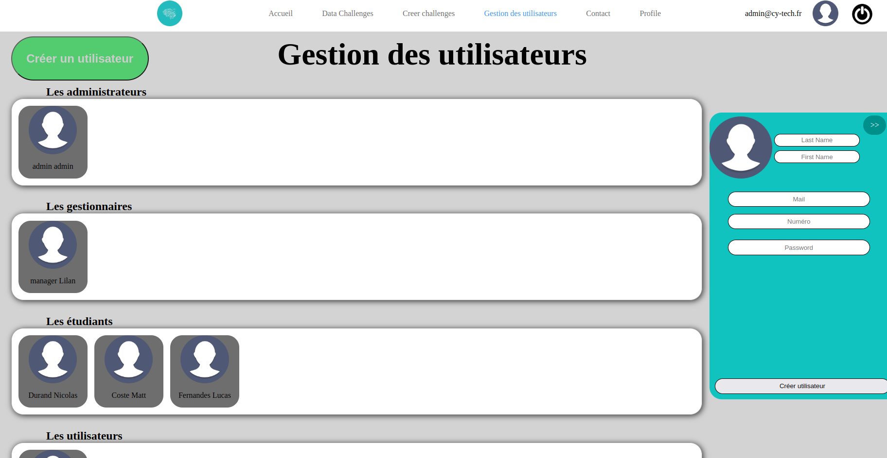

# I. Introduction 

&nbsp;&nbsp;&nbsp;&nbsp;&nbsp; Dans le cadre de notre première année du cycle ingénieur, il nous est proposé la réalisation d'un projet pour mettre en pratique nos connaissances.
Ce projet consiste en la réalisation d'une application pour IA Pau permettant la création et l'administration de data challenges.

# II. Stockage des données

&nbsp;&nbsp;&nbsp;&nbsp; L'utilisation d'une base de données dans le contexte de ce projet est évident pour pouvoir stocker diverses informations comme celles concernant les utilisateurs ou les data chalenges.
Ainsi, nous avons réalisé un modèle conceptuel de données (MCD) pour réaliser ensuite la structure de la base de données.

## &nbsp;&nbsp;&nbsp; 1. Le Modèle conceptuel de données

{height=40%}

&nbsp;&nbsp;&nbsp; Un utilisateur peut être soit un administrateur, un gestionnaire ou un étudiant (un participant).
Un ensemble d'utilisateurs quelconques peut recevoir un message donné et un utilisateur peut aussi envoyer un message. On peut considérer qu'un étudiant puisse envoyer un message à un administrateur sous des conditions particulières (requête pour résoudre un bug, etc) qui peuvent être gérées lors du développement de l'application.
Un même groupe peut participer à plusieurs data challenge en même temps d'où la cardinalité dans le MCD.

Cependant, tous les data challenges ont des sujets différents, des resources différentes et s'ils contiennent un quiz, un quiz différent les uns des autres. D'où la cardinalité (1, 1) du côté de la table DataChallenge.
Enfin, on considère qu'un gestionnaire gère le data challenge complet (on aurait pu définir des gestionnaires qui gèrent seulement un ou des sujets d'un data challenge).

## &nbsp;&nbsp;&nbsp; 2. La base de données

&nbsp;&nbsp;&nbsp; Nous avons choisi d'utiliser la base de données mySQL pour stocker les informations nécessaires.

Nous avons pris parti d'inclure l'identifiant des data challenge en tant que clé étrangère dans les tables Quiz et Resource puisqu'elles sont uniques à chaque data challenge ainsi qu'à la table Group puique le cas d'un même groupe qui participe à plusieurs data challenges en même temps reste un cas très particulier.

### &nbsp;&nbsp;&nbsp;&nbsp;&nbsp;&nbsp; a. Gestion de la connexion à la base de données

&nbsp;&nbsp;&nbsp;&nbsp; Plusieurs fonctions php pour gérer la connexion à la base de données sont présentes dans le fichier bdd.php. 

- connect_db($host = DB_HOST, $user = DB_USER, $pass = DB_PASS, $db = DB_NAME)

- is_connected_db()

- disconnect_db()

Ces fonctions servent respectivement dans le cas général à se connecter à la base de données, vérifier si on est connecté et enfin se déconnecter.

### &nbsp;&nbsp;&nbsp;&nbsp;&nbsp;&nbsp; b. Récupération des données de la base de données

&nbsp;&nbsp;&nbsp;&nbsp; Pour simplifier l'aspect front et la création des diverses pages nécessaires, plusieurs fonctions ont été codées pour accéder aux informations stocker dans la base de données.
Ces fonctions dans bdd.php sont identifiables par un "get" au début du nom de la fonction. De plus, une fonction request_db($dbRequestType, $request = null) permet dans le cas général d'envoyer une requête à la base de données.

### &nbsp;&nbsp;&nbsp;&nbsp;&nbsp;&nbsp; c. Modification des données de la base de données

&nbsp;&nbsp;&nbsp;&nbsp; De même, de multiples fonctions ont été codées pour modifier les informations stockées dans la base de données toujours dans le but de simplifier l'aspect front de l'application.
Ces fonctions dans bdd.php sont identifiables par un "alter" au début du nom de la foncion. Il existe par exemple une fonction pour modifier les informations d'un user ou data challenge.

# III. Les fonctionnalités implémentées

&nbsp;&nbsp;&nbsp;&nbsp; Les fonctionnalités qui ont pu être implémentées dans l'application sont présentées dans cette partie.

## &nbsp;&nbsp;&nbsp; 1. Administration des utilisateurs

{height=40%}

&nbsp;&nbsp;&nbsp; L'accès à ce menu est réservé aux administrateurs. La gestion de tous les utilisateurs et la possibilité d'en créer un nouveau (menu côté droit) sont possibles.

{height=30%}

&nbsp;&nbsp;&nbsp; La modification des informations d'un utilisateur, le supprimer ainsi que la possibilité de créer un gestionnaire à partir d'un utilisateur. À noter que les données d'un administrateur peuvent seulement être modifiées à partir de ce menu. En d'autres termes la suppression d'un administrateur n'y est pas possible.

## &nbsp;&nbsp;&nbsp; 2. Administration des data challenges

{height=40%}

&nbsp;&nbsp;&nbsp; Le menu de création d'un data challenge avec ses informations de base. L'ajout de sujets est possible dans la limite de 3 sujets avec chacun son nom et sa description.

## &nbsp;&nbsp;&nbsp; 3. Gestion des data challenges
333

## &nbsp;&nbsp;&nbsp; 4. La messagerie
444

### &nbsp;&nbsp;&nbsp;&nbsp;&nbsp;&nbsp; a. La messagerie entre utilisateurs
aaa

### &nbsp;&nbsp;&nbsp;&nbsp;&nbsp;&nbsp; b. La messagerie pour un gestionnaire
bbb

## &nbsp;&nbsp;&nbsp; 5. Gestion des groupes
555

## &nbsp;&nbsp;&nbsp; 6. Analyse de code source
666

### &nbsp;&nbsp;&nbsp;&nbsp;&nbsp;&nbsp; a. Analyseur de code
aaa

### &nbsp;&nbsp;&nbsp;&nbsp;&nbsp;&nbsp; b. Visualisation des résultats
bbb

# IV. Les fonctionnalités qui restent à implémenter
Another paragraph
    